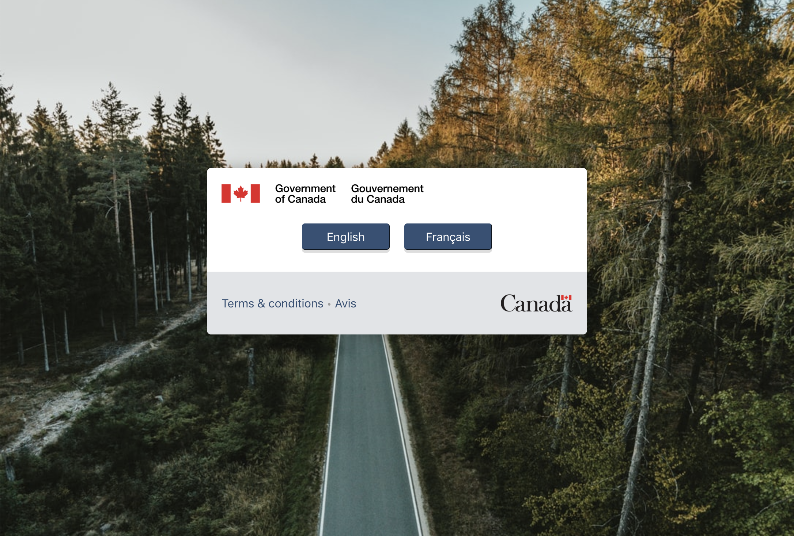

# GC-Tortilla
[](https://www.npmjs.com/package/gc-tortilla) [](https://standardjs.com)

## Description
GC-Tortilla is a React library designed to help speed up the development of Government of Canada applications by providing pre-approved branded components. All elements in the components are fully customizable so they can be used by different teams with their own branding as needed.

## Features
With GC-Tortilla you get a **Splash Screen**, **Header Brand Bar** and a **Footer** all of which are brand ready. The splash screen is unique in that it will use LocalStorage so that once the user set's their initial language preference they will not be forced to re-visit the splash screen every time they access the app.

You can utilize all components pre-packaged together by importing **GCTortilla** or you have the option to import **GCSplashScreen**, **GCHeader** and **GCFooter** separately to use them on their own.

## Screenshots



## Install

```bash
npm install --save gc-tortilla
```

## Usage

### GCTortilla
> This is the easiest way to get started

```jsx
import React from 'react';
import { GCTortilla } from 'gc-tortilla';

function App() {
    return (
        <GCTortilla>
            {/* Your app code goes here */}
        </GCTortilla>
    );
}

export default App;
```

### GCTortilla Customization
> GCTortilla can be customized by passing the following **optional** props

- **Signature FIP / Branding**: An object containing the branding element that appears at the top of the splash screen window & header *(Defaults to the Government of Canada Signature FIP)*. The object has 3 properties:
    - **Image**: *(Required)* URL or file path of an image
    - **Alt Text**: *(Optional)* Used in the image's ```alt``` attribute
    - **Title**: *(Optional)* Used in the image's ```title``` atteribute

```jsx
    <GCTortilla signatureFIP={{
        image: "images/logo/FIP.png",
        altText: "My organization's branding"
    }}
```

- **Logo**: An object containing the app's logo that appears in the center of the splash screen window. The object has 3 properties:
    - **Image**: *(Required)* URL or file path of an image
    - **Alt Text**: *(Optional)* Used in the image's ```alt``` attribute
    - **Title**: *(Optional)* Used in the image's ```title``` atteribute
   
```jsx
    <GCTortilla logo={{
        image: "images/logo/logo.png",
        altText: "My app's logo"
    }}
```


- **Routes**: An object containing routes for the site's home page in both French and English *(defaults to ```'/en'``` for English and ```'/fr'``` for French)*
    - **English**: *(Required)* Path of the English home page
    - **French**: *(Required)* Path of the French home page
```jsx
    <GCTortilla routes={{
        english: "/english",
        french: "/francais"
    }}
```

- **Terms & Conditions**: Show on the splash screen, terms & conditions is an object containing two objects (English/French) with a URL and a label. Although this is meant to be terms and conditions, you may use this prop to link to anything *(Defaults to the Canada.ca Terms & Conditions in both French and English)*. If you choose to pass the terms prop it **must include** the following properties
    - **English**: Object containing a URL and label for the English terms and conditions
       - **URL**: English terms and conditions URL
       - **Label**: The link's text that the user can click on
    - **French**: Object containing a URL and label for the French terms and conditions
       - **URL**: French terms and conditions URL
       - **Label**: The link's text that the user can click on
```jsx
    <GCTortilla terms={{
        english: {
            url: "https://www.canada.ca/en/transparency/terms.html",
            label: "Terms"
        },
        french: {
            url: "https://www.canada.ca/fr/transparence/avis.html",
            label: "Avis"
        }
    }}/>
```

- **Wordmark FIP / Branding**: An object containing the branding element that appears at the bottom of the splash screen window & footer *(Defaults to the Government of Canada Wordmark FIP)*. The object has 3 properties:
    - **Image**: *(Required)* URL or file path of an image
    - **Alt Text**: *(Optional)* Used in the image's ```alt``` attribute
    - **Title**: *(Optional)* Used in the image's ```title``` atteribute

```jsx
    <GCTortilla wordmarkFIP={{
        image: "images/logo/FIP.png",
        altText: "My organization's branding"
    }}
```

- **Footer Theme**: Can choose between a ```light``` or ```dark``` theme for the footer *(defaults to dark)*
```jsx
    <GCTortilla footerTheme={"light"}/>
```


- **Footer Links**: An array of objects containing the links to be shown in the footer. If you choose to pass in some links you must pass the following properties:
    - **URL**: The url you wish to link to
    - **Label**: The link's text that the user can click on
    - **Title**: *(Optional)* Used in the link's ```title``` attribute
```jsx
    <GCTortilla footerLinks={[
        {
            url: "https://www.google.ca",
            label: "Google",
            title: "Takes you to Google"
        },
        {
            url: "https://www.facebook.com",
            label: "Facebook"
        },
        {
            url: "https://www.youtube.com",
            label: "YouTube"
        }
    ]}/>
```


- **Background Image**: A URL or file path of an image to be used in the background of the splash screen *(Defaults to a random image from [Unsplash](https://unsplash.com))*

```jsx
    <GCTortilla backgroundImage={"images/splashBG.jpg"}/>
```

### GCSplashScreen


> If you wish to make use the splash screen without GCTortilla simply import GCSplashScreen and use the component anywhere within your app's main page

```jsx
import React from 'react';
import { GCSplashScreen } from 'gc-tortilla';

function App() {
    return (
        <div className="App">
            <GCSplashScreen/>
            {/* The rest of your app code goes here */}
        </div>
    );
}

export default App;
```

#### GCSplashScreen Customization
> GCSplashScreen can be customized by passing the following **optional** props

- **Signature FIP / Branding**: An object containing the branding element that appears at the top of the splash screen window *(Defaults to the Government of Canada Signature FIP)*. The object has 3 properties:
    - **Image**: *(Required)* URL or file path of an image
    - **Alt Text**: *(Optional)* Used in the image's ```alt``` attribute
    - **Title**: *(Optional)* Used in the image's ```title``` atteribute

```jsx
    <GCSplashScreen signatureFIP={{
        image: "images/logo/FIP.png",
        altText: "My organization's branding"
    }}
```

- **Logo**: An object containing the app's logo that appears in the center of the splash screen window. The object has 3 properties:
    - **Image**: *(Required)* URL or file path of an image
    - **Alt Text**: *(Optional)* Used in the image's ```alt``` attribute
    - **Title**: *(Optional)* Used in the image's ```title``` atteribute
   
```jsx
    <GCSplashScreen logo={{
        image: "images/logo/logo.png",
        altText: "My app's logo"
    }}
```


- **Routes**: An object containing routes for the site's home page in both French and English *(defaults to ```'/en'``` for English and ```'/fr'``` for French)*
    - **English**: *(Required)* Path of the English home page
    - **French**: *(Required)* Path of the French home page
```jsx
    <GCSplashScreen routes={{
        english: "/english",
        french: "/francais"
    }}
```

- **Terms & Conditions**: An object containing two objects (English/French) with a URL and a label. Although this is meant to be terms and conditions, you may use this prop to link to anything *(Defaults to the Canada.ca Terms & Conditions in both French and English)*. If you choose to pass the terms prop it **must include** the following properties
    - **English**: Object containing a URL and label for the English terms and conditions
       - **URL**: English terms and conditions URL
       - **Label**: The link's text that the user can click on
    - **French**: Object containing a URL and label for the French terms and conditions
       - **URL**: French terms and conditions URL
       - **Label**: The link's text that the user can click on
```jsx
    <GCSplashScreen terms={{
        english: {
            url: "https://www.canada.ca/en/transparency/terms.html",
            label: "Terms"
        },
        french: {
            url: "https://www.canada.ca/fr/transparence/avis.html",
            label: "Avis"
        }
    }}/>
```

- **Wordmark FIP / Branding**: An object containing the branding element that appears at the bottom of the splash screen window *(Defaults to the Government of Canada Wordmark FIP)*. The object has 3 properties:
    - **Image**: *(Required)* URL or file path of an image
    - **Alt Text**: *(Optional)* Used in the image's ```alt``` attribute
    - **Title**: *(Optional)* Used in the image's ```title``` atteribute

```jsx
    <GCSplashScreen wordmarkFIP={{
        image: "images/logo/FIP.png",
        altText: "My organization's branding"
    }}
```

- **Background Image**: A URL or file path of an image to be used in the background of the splash screen *(Defaults to a random image from [Unsplash](https://unsplash.com))*

```jsx
    <GCSplashScreen backgroundImage={"images/splashBG.jpg"}/>
```

### GCHeader


> If you wish to make use the header without GCTortilla simply import GCHeader and place the component where you'd like it to appear in your app. If you want to have it at the very top (recommended) then place it at the top of your component

```jsx
import React from 'react';
import { GCHeader } from 'gc-tortilla';

function App() {
    return (
        <div className="App">
            <GCHeader/>
            {/* The rest of your app code goes here */}
        </div>
    );
}

export default App;
```

#### GCHeader Customization
> GCHeader can be customized by passing the following **optional** props

- **Signature FIP / Branding**: An object containing the branding element that appears in the header *(Defaults to the Government of Canada Signature FIP)*. The object has 3 properties:
    - **Image**: *(Required)* URL or file path of an image
    - **Alt Text**: *(Optional)* Used in the image's ```alt``` attribute
    - **Title**: *(Optional)* Used in the image's ```title``` atteribute

```jsx
    <GCHeader signatureFIP={{
        image: "images/logo/FIP.png",
        altText: "My app's logo"
    }}
```

### GCFooter
> If you wish to make use the footer without GCTortilla simply import GCFooter and place the component where you'd like it to appear in your app. If you want to have it at the very bottom (recommended) then place it at the bottom of your component

```jsx
import React from 'react';
import { GCFooter } from 'gc-tortilla';

function App() {
    return (
        <div className="App">
            {/* The rest of your app code goes here */}
            <GCFooter/>
        </div>
    );
}

export default App;
```

#### GCFooter Customization
> GCFooter can be customized by passing the following **optional** props

- **Theme**: Can choose between a ```light``` or ```dark``` theme *(defaults to dark)*
```jsx
    <GCFooter theme={"light"}/>
```


- **Links**: An array of objects containing the links to be shown in the footer. If you choose to pass in some links you must pass the following properties:
    - **URL**: The url you wish to link to
    - **Label**: The link's text that the user can click on
    - **Title**: *(Optional)* Used in the link's ```title``` attribute
```jsx
    <GCFooter links={[
        {
            url: "https://www.google.ca",
            label: "Google",
            title: "Takes you to Google"
        },
        {
            url: "https://www.facebook.com",
            label: "Facebook"
        },
        {
            url: "https://www.youtube.com",
            label: "YouTube"
        }
    ]}/>
```


- **FIP / Branding**: An object containing the branding element that appears in the footer *(Defaults to the Government of Canada Black & White Wordmark FIP)*. The object has 3 properties:
    - **Image**: *(Required)* URL or file path of an image
    - **Alt Text**: *(Optional)* Used in the image's ```alt``` attribute
    - **Title**: *(Optional)* Used in the image's ```title``` atteribute

```jsx
    <GCFooter FIP={{
        image: "images/logo/FIP.png",
        altText: "My app's logo"
    }}/>
```

## License

MIT © [Jordan-Morrison](https://github.com/Jordan-Morrison)
